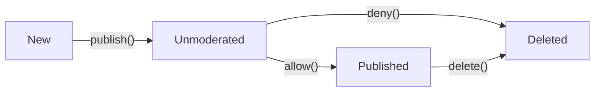

Step 1.1: Type safety
=====================

[Rust] has a rich type system which allows to express our program primitives, entities and notions in a unique way. The benefits of this are obvious: the more compiler knows about our problem - the more false programs it will decline. Or, rephrased: __the more we describe about the program in types - the more we reduce the probability for the program to be incorrect__.


## Using types 

Here is an examples which demonstrates the problem:
```rust
#[derive(Clone)]
struct Post {
    id: u64,
    user_id: u64,
    title: String,
    body: String,
}

fn repost(post: &Post, new_author_id: u64) -> Post {
    let mut new_post = post.clone();
    new_post.id = new_author_id;  // Oops!
    new_post
}
```

That's how description with types solves the problem:
```rust
mod post {
    #[derive(Clone)]
    pub struct Id(pub u64);

    #[derive(Clone)]
    pub struct Title(pub String);

    #[derive(Clone)]
    pub struct Body(pub String);
}

mod user {
    #[derive(Clone)]
    pub struct Id(pub u64);
}

#[derive(Clone)]
struct Post {
    id: post::Id,
    user_id: user::Id,
    title: post::Title,
    body: post::Body,
}

fn repost(post: &Post, new_author_id: user::Id) -> Post {
    let mut new_post = post.clone();
    new_post.id = new_author_id;  // Does not compile!
    new_post
}
```

The program simply won't compile with the following error:
```
error[E0308]: mismatched types
  --> src/main.rs:27:19
   |
27 |     new_post.id = new_author_id;
   |                   ^^^^^^^^^^^^^ expected struct `post::Id`, found struct `user::Id`
   |
   = note: expected type `post::Id`
              found type `user::Id`

error: aborting due to previous error
```

As we see, using separate types for separate notions __prevents us from the whole class of misusage errors at compile time__. Even more, it __makes program more understandable for developers__, as the used notions are named and described better.


## Behavior in types

Types are good, because they allow the compiler to separate the notions as we do. Fortunately, we can rich even more.

[Rust] uses [traits][Rust Book: Traits] to express notions behavior, and [generics][Rust Book: Generics] which allow to parametrize you type. Their combination allow us to express in types __behavior which can be validated at compile time__. Examples of applying this idea are described in details in the following articles:

- [Pretty State Machine Patterns in Rust][1]
- [Typestates in Rust][2]
- [Rust By Example: Phantom type parameters][3]


## Task

Let's return back to our `Post` struct. Let's assume the situation that we have the following flow of posts in our application:



Write [Rust] program that implements and demonstrates this flow. The key __requirement is to be type safe__, which means, for example, that calling `delete()` on `New` post (or calling `deny()` on `Deleted` post) must not be allowed at compile time.


[Rust]: https://www.rust-lang.org
[Rust Book: Generics]: https://doc.rust-lang.org/book/second-edition/ch10-01-syntax.html
[Rust Book: Traits]: https://doc.rust-lang.org/book/second-edition/ch10-02-traits.html

[1]: https://hoverbear.org/2016/10/12/rust-state-machine-pattern
[2]: https://yoric.github.io/post/rust-typestate
[3]: https://doc.rust-lang.org/stable/rust-by-example/generics/phantom.html
